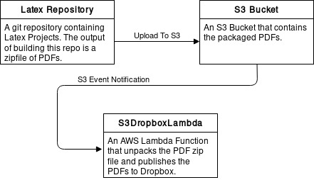

# The Dossier System

The Dossier System is an [AWS CloudFormation][] and [AWS Lambda][] project that publishes [Latex][] documents to
[Dropbox][]. The problem that this system solves is:
  1. Neither Latex PDFs or intermediary files are commited to the source repository
  2. The projects are built in a reproducable manner
  3. The Latex PDFs are published to an easily accessible location

(2) is solved by using [Docker][] and (3) is solved by using AWS Lambda to publish the artifacts from building the Latex
documents to Dropbox.

The system, pictorially, looks like the following pipeline:
<p align="center">
  
</p>

The CloudFormation project is located on GitHub at [DossierCloudFormationRuby][].

[AWS CloudFormation]: https://aws.amazon.com/cloudformation/
[AWS Lambda]: https://aws.amazon.com/lambda/
[Latex]: https://www.latex-project.org/
[Docker]: https://www.docker.com/
[Dropbox]: https://www.dropbox.com/
[DossierCloudFormationRuby]: https://github.com/ErrorsAndGlitches/DossierCloudFormationRuby

# S3DropboxLambda: The AWS Lambda Function

S3DropboxLambda is an AWS Lambda function written in scala whose purpose is to react to
[Amazon S3 Event Notifications][]. The Lambda function expects a compressed zip file, which is decompressed and the
packaged files are published to Dropbox. The Dropbox short term credentials are fetched and saved to a file in S3 using
KMS encryption. The following environment variables configure this in the Lambda function:

* `DBX_CREDENTIAL_S3_BUCKET`: S3 bucket to store Dropbox short term credentials
* `DBX_CREDENTIAL_S3_KEY`: S3 key to store Dropbox short term credentials
* `DBX_CREDENTIAL_KMS_ID`: KMS ID used to encrypted Dropbox credentials in S3

You can bootstrap the credentials by fetching credentials using (see repo README for usage):

* https://github.com/dropbox/dropbox-sdk-java/blob/master/examples/authorize/src/main/java/com/dropbox/core/examples/authorize/Main.java

And then uploading the credentials to the respective S3 location. You can run the application locally via:

```
sbt run-dossier --help
```

[Amazon S3 Event Notifications]: http://docs.aws.amazon.com/AmazonS3/latest/dev/NotificationHowTo.html
[Dropbox access token]: https://www.dropbox.com/developers/reference/oauth-guide

# Building

The project is built using [Scala Built Tool (SBT)][]. Since AWS Lambda requires a fat JAR (i.e. a JAR with the
project and all of its dependencies), the [sbt-assembly][] sbt plugin is used.

[Scala Built Tool (SBT)]: http://www.scala-sbt.org/
[sbt-assembly]: https://github.com/sbt/sbt-assembly

## Building Locally

The only requirements to build the project are scala and SBT. Install those using your favorite package manager. To
build the project, run the tests, and build the fat jar:

```
sbt assembly
# this generates the fat jar: target/S3DropboxLambda-assembly-1.0.jar
```

## Building with CodeBuild

The S3DropboxLambda project is part of a CloudFormation stack, which is configured to build the project using
[CodeBuild][]. CodeBuild using a special file in the repository called [buildspec.yml][]. The CodeBuild project can be
configured to use a Docker file that supports SBT such as [1science/sbt][].

The CodeBuild project requires the following environment variables to be defined. To see how they are specifically used,
see the [buildspec.yml][] file.

| Variable Name             | Description                                                                              |
|---------------------------|------------------------------------------------------------------------------------------|
| `LAMBDA_CODE_JAR_BUCKET`  | S3 Bucket to publish the fat JAR to                                                      |
| `LAMBDA_CODE_JAR_KEY`     | S3 Object key of the fat Jar                                                             |
| `LAMBDA_FUNCTION_ARN`     | Used by the `buildspec.yml` to update the given Lambda function's configuration and code |
| `BUILD_FAILURE_PHONE_NUM` | In the event of a build failure, the phone number to send an alert SMS to                |
| `DBX_CREDENTIAL_S3_BUCKET`| S3 bucket to store Dropbox short term credentials |
| `DBX_CREDENTIAL_S3_KEY`   | S3 key to store Dropbox short term credentials |
| `DBX_CREDENTIAL_KMS_ID`   | KMS ID used to encrypted credentials in S3 |

[CodeBuild]: https://aws.amazon.com/codebuild/
[buildspec.yml]: https://github.com/ErrorsAndGlitches/S3DropboxLambda/blob/master/buildspec.yml
[1science/sbt]: https://hub.docker.com/r/1science/sbt/

## Running Tests

```
# run all tests
sbt test
# run single test
sbt "testOnly com.s3dropbox.lambda.ManifestSpec"
```
